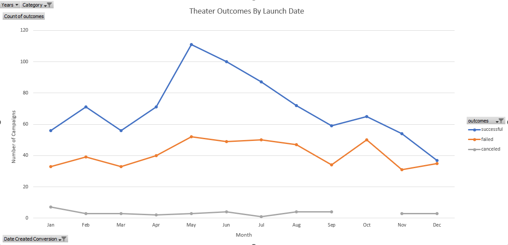
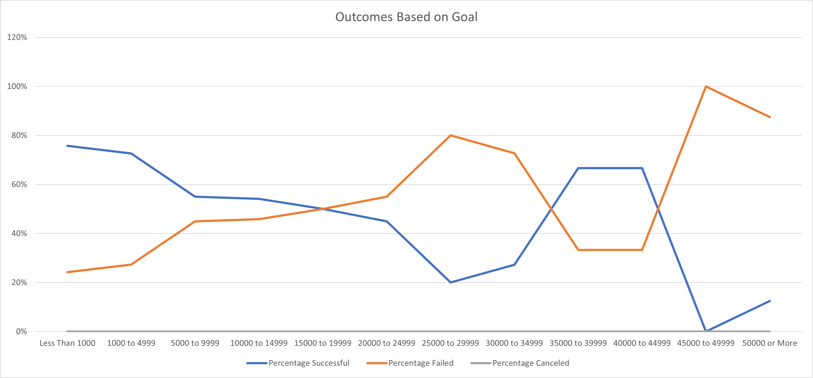

# Kickstarting with Excel

## Overview of Project

Kickstarter campaigns are a method of Crowdfunding to help creatives, inventors, and visionary’s ideas to life. We have been approached by a client who is interested in an analysis of past Theater markets and how successful their campaigns for crowdfunding were based on a variety of factors.

### Purpose

This analysis of Kickstarter campaigns seeks to gain insight into how, and if, either the launch date or goal amount will impact the success of the campaign. By paying attention to these two variables, this analysis may be able to provide future Kickstarter users with an idea of what goals to set and when to hold their campaigns to ensure they are effective.

## Analysis and Challenges

### Analysis of Outcomes Based on Launch Date

Based on the Theater Outcomes By Launch Date analysis, we can conclude several important facts. May had the highest amount of campaigns launched, in both the successful campaigns (totaling 111 for the month), and failed campaigns, totaling 52 for the month. January held the highest number of canceled campaigns (7), while October, had no canceled campaigns. Coincidentally, after a few months of campaign successes dropping off from May to September, October brought a spike in both successful and failed campaigns. The amount of failed and successful campaigns is almost equal in December.

### Analysis of Outcomes Based on Goals

The Outcomes Based on Goals data displays that the percentage of successful campaigns and the percentage of failed campaigns have an inverse relationship. This relationship suggests that certain goal levels are more likely to succeed than other ones, ranging from goals less than $1,000-$10,000 to $14,999 range in which we see a steep increase in failed campaigns. The campaigns set with a goal range of both $35,000 to $39,999 and $40,000 to $44,999 prove to come close to being as successful as the successful ranges. From this data, we can conclude the actual dollar value of the goal being set can be predictive of how successful the campaign may be.

### Challenges and Difficulties Encountered

The challenges I had were in trying to place the proper categories into the pivot tables so that the data was readable. It took a bit of time each time for me to place it correctly. I overcame this by searching for a tutorial on pivot tables and charts. Another challenge I was came to creating the conditional for the Outcomes Based Goal. I sought guidance from google and looked at examples of other conditionals used in excel (less than, greater than, and equal to) and managed to get the function to work properly.

## Results

- **What are two conclusions you can draw about the Outcomes based on Launch Date?**
- Two conclusions we can draw from this data is that the launch date will certainly impact the likelihood of campaign success seeing as May had 66% of the total campaigns be successful out of all theater campaigns being held. The data also suggests that in the later months of the year, campaign success tapers off. This could be simply due to the holiday months taking precedence over donor spending. This may also be due to holiday travel, and donors not having adequate exposure to the campaign. Regardless, the later portions of the year seem to not have as much success.

- **What can you conclude about the Outcomes based on Goals?**
- There seems to be a relationship between campaigns and goal amounts to fundraise that, generally speaking, the lower the goals of the campaign, the more likely the success rate and the higher the goal amount, the higher the liklihood of failing.

- **What are some limitations of this dataset?**
- The limitations of the dataset is that that we don't know any more specifics about the campaigns other than general information such as time of year, number of donors, and categories. Some more useful information that could explain the success and failures could include information about the Kickstarter Campaign's outreach and marketing - how many posts per week were made on Kickstarter, on other social media accounts, how many weekly views were the campaigns getting, etc. Other limitations are how many of the shows that share similar genres were going on at once, and would this have any impact on their success or failure? There are many environmental factors that are examined, but variables about the action behind the campaigns could show more trends.

- **What are some other possible tables and/or graphs that we could create?**
- Other possible tables/graphs that we could create with the current data set would be a combo chart between the Success/Failures of campaigns, as well as the amount of donors behind campaigns to see if there is any relationship between the amount of donors and the success of a campaign. We could also use a combo-chart again to compare the similarities and differences between success and failure during fiscal quarters and seasonal quarters to see if there are any trends relating to the financial and holiday calendars.